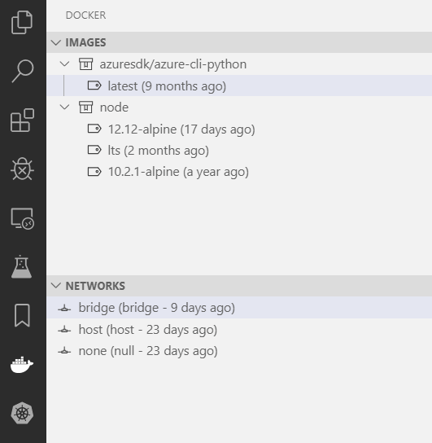
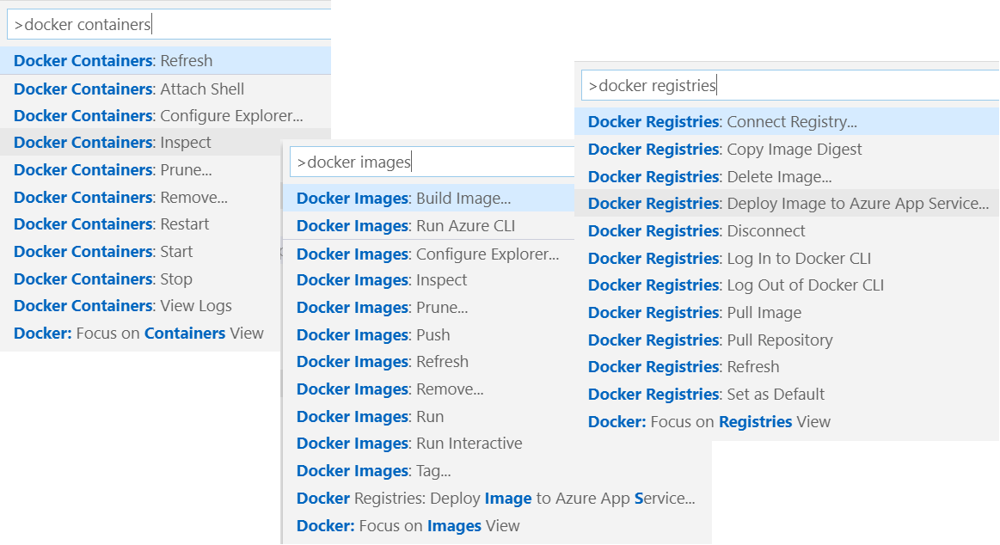

## What is Docker?

Docker is one implementation of container based virtualization technologies.

### Pre-Virtualization World


Problems:

- Cost
- Slow deployment
- Hard to migrate to different vendors

### Hypervisor-based Virtualization


- VMWare / VirtualBox are examples of using this technology
- Can run multiple operating systems on same machine
- Cost-efficient
- Separate disk and memory usage
- Easy to scale

### Disadvantages

- Kernel resource duplication
- Application portability issues

### Container-based Virtualization


- Main difference with hypervisor-based virtualization is the replication of the kernels.
- In hypervisor model each app has its own kernel.
- Container model has one kernel and the containers have isolated runtime binaries and applications.
- Containers share the host OS so they are more lightweight and faster.

### Advantages

- Cost-efficient
- Use less CPU, RAM and disk space
- Fast deployment
- Guaranteed portability

## Docker client-server architecture

Once installed Docker runs a daemon which the client communicates with.


The Docker Daemon does the work of building, running and distributing your Docker containers.

The Docker Daemon is often referred to as the Docker Engine or Docker Server.

## Installing on Windows

[Install Docker Desktop on Windows](https://docs.docker.com/docker-for-windows/install/)

**System Requirements**

- Windows 10 64-bit: Pro, Enterprise, or Education (Build 15063 or later).
- Hyper-V and Containers Windows features must be enabled.

Included with installation:

- Docker Engine
- Docker CLI Client
- Docker Compose
- Docker Machine
- Kitematic

Once installed you can open a terminal window and type `docker info` to see configuration.

## Images and Containers

### Images

- Images are read only templates used to create containers.
- Images are created with the `docker build` command, either by you or by other docker users.
- Images are designed to be composed of layers of other images.
- Images can be stored in a Docker registry such as [DockerHub](https://hub.docker.com/)

### Containers

- If an image is a class, then a container is an instance of a class - a runtime object.
- Containers are lightweight and portable encapsulations of an environment in which to run applications.
- Containers are created from images. Inside a container, it has all the binaries and dependencies needed to run the application.

## Registries and Repositories

- A registry is where we store our images.
- You can host your own registry, or you can use Docker's public registry which is called [DockerHub](https://hub.docker.com/).
- Inside a registry, images are stored in repositories.
- Docker repository is a collection of different docker images with the same name, that have different tags, each tag usually represents a different version of the image.

## Hello World example

- Search for `busybox` in [DockerHub](https://hub.docker.com/_/busybox).
- Open terminal window.
- Enter `docker run busybox:1.24 echo "hello world"`
- If busybox image is not installed it will pull from DockerHub.
- If you re-type the command it will be much faster because the image is already downloaded.
- Enter `docker images` to see all images installed.
- Enter `docker run busybox:1.24 ls` to list all files and directories in container entry point.
- To start an interactive container we use the `-i -t` CLI options.
- Enter `docker run -i -t busybox:1.24`
- You are now in the container. Enter `exit` to exit the container.
- If you run the docker command again it will be a NEW container, not the same one.

## Foreground vs Detached containers

#### Run container in foreground mode

- `docker run` starts the process in the container and attaches the console to the process's standard input, output and standard error.
- The console can not be used without exiting from the container.

### Run container in detached mode

- `docker run -d` starts the container in detached mode.
- Exits when the root process used to run the container finishes.
- The console can be used for other commands after the container has started.

Docker container information remains, even after it finishes executing. To remove the container from the container list after it has completed its tasks you can manually remove the container in the command line or add the `--rm` option in the run command.

## Common Docker commands

- `docker images` - list all Docker images installed.
- `docker run repository:tag command [arguments]`
  - example: `docker run busybox:1.24 echo "hello world"`
- `docker run -i -t` - runs container in interactive mode.
- `docker ps` - shows all running containers.
- `docker ps -a` - shows all containers.
- `docker run --rm` - removes the container after it finishes.
- `docker run --name *myownname* busybox:1.24` - Creates a new container with a name identifier. If you do not specify a name Docker will autogenerate a name for the container.
- `docker inspect *container-id-or-name*` - outputs low level information on container.

## Docker port mappings and Docker Logs

You can bind a host port to a container port with the `-p host-port:container:port` option.

For example: `docker run --name my-drupal -p 8080:80 drupal`

Binds the host port 8080 to container port 80.

If you run the container in detached mode you can use `docker logs _Container_ID_` to get the output from the container.

## Docker image layers

- A Docker image is built up from a series of layers.
- Each layer represents an instruction in the image’s Dockerfile.
- Each layer except the very last one is read-only.
- You can see the layers in an image with the `docker history` command

`docker history busybox:1.24`

This allows multiple Docker containers to share images


## Build Docker images

There are two ways to build a docker image.

- Commit changes made in a Docker container
- Write a new Dockerfile

#### First method:

- `docker run -it debian:jessie` - installs and runs debian in interactive mode.
- `apt-get update && apt-get install -y git` - installs git
- `exit` to exit container
- `docker ps -a`
- To create a new image from current container we use the `commit` command.
  - _docker commit [OPTIONS] CONTAINER [REPOSITORY[:TAG]]_
- `docker commit _container_ID_ doodlepie/debian-git:1.0.1`
- `docker images` - lists all images on host. You should see new image created.

#### Second method:

- A Dockerfile is a text document that contains all the instructions to assemble an image.
- Each instruction will create a new image layer.
- Instructions specify what to do when building the image.

Create a file with the name `Dockerfile`.

Edit the file and add commands. The first command must be `FROM`.

For example:

```
FROM debian:jessie
RUN  apt-get udpate
RUN apt-get install -y git
RUN apt-get install -y vim
```

to build the image use the command `docker build [OPTIONS] PATH | URL | -`

`docker build -t doodlepie/debian-git-vim:1.0.1 .`

The . at the end specifies the current path context for the image.

#### Best Practices

Each `RUN` command will execute the command on the top writeable layer of the container, then commit the container as a new image.

The new image is used for the next step in the Dockerfile. So each `RUN` instruction will create a new image layer.

It is recommended to chain the `RUN` instructions in the Dockerfile to reduce the number of image layers it creates.

For example, we can combine the three `RUN` statements above into one line.

```
FROM debian:jessie
RUN  apt-get udpate && apt-get install -y \
  git \
  vim
```

It is a best practice to sort multi-line arguments alphanumerically. This will help avoid duplication of packages and the make the list easier to update.

For example, if we wanted to install python we would add it in alphanumerical order.

```
FROM debian:jessie
RUN  apt-get udpate && apt-get install -y \
  git \
  python \
  vim
```

### CMD Instruction

- `CMD` instruction specifies what command you want to run when the container starts up.
- If we don't specify `CMD` instruction in the Dockerfile, Docker will use the default command defined in the base image.
- The `CMD` instruction doesn't run when building the image, it only runs when the container starts up.
- You can specify the command in exec form or in shell form.

```
FROM debian:jessie
RUN  apt-get udpate && apt-get install -y \
  git \
  vim
CMD ["echo", "hello world"]
```

### COPY and ADD Instruction

The `COPY` instruction copies new files or directories from build context and adds them to the file system of the container.

- `COPY hom* /mydir/` # adds all files starting with "hom" to the /mydir/ directory.

The `ADD` instruction is very similar to the `COPY` command.

- `ADD` can not only copy files but also download a file from a url and copy to the container.
- `ADD` instruction also has the ability to automatically unpack compressed files.

## Push Images to Docker Hub

[DockerHub](https://hub.docker.com/) - a public library of Docker images.

Sign up at [https://hub.docker.com/](https://hub.docker.com/)

To associate an image with your Docker hub account you use the `docker tag` command.

`docker tag _Container_ID_ doodlepie/debian-git-vim:1.0.3`

If you do not specify a tag on the build Docker will use latest as the default tag. This is only a convention and does not necessarily mean "most recent" update.

To push to DockerHub you first need to login from command line.

`docker login` - use the DockerHub account and password here.

Once logged in you can now push your images to DockerHub

`docker push doodlepie/debian-git-vim:1.0.3`

## Containerize a simple node web app

Git clone this repo:

`git clone -b v0.1 https://github.com/DavidKindler/simple-nodejs-docker`

Here are the statements in the Dockerfile.

```yml
# Download the slim version of node from DockerHub
FROM node:slim

# Create app directory
WORKDIR /usr/src/app

# Install app dependencies
# A wildcard is used to ensure both package.json AND package-lock.json are copied
# where available (npm@5+)
COPY package*.json ./

RUN npm install
# If you are building your code for production
# RUN npm ci --only=production

# This bundles all the files and copies them to the container.
COPY . .

# expose the port used in the server.js app
EXPOSE 3000

# start the server
CMD [ "node", "server.js" ]

```

Build your image from the Dockerfile.

`docker build -t node-web-app:v0.1 .`

Docker will build the image and copy all the source files into it.

`docker images` - You should now see the new image in the list.

Use the image id or name to run the new image:

`docker run -p 3000:3000 -d node-web-app:v0.1`

## Docker Compose

A docker compose file lets you define the different services involved in your application such as web, database, messaging, etc.

Once the file is defined you can bring up the entire stack with the `docker compose up` command.

The docker compose file is a YAML file with a dictionary named `services`. It has a list of services defined in a key/value format. The key is the name of your service. Each key must have a minimum specification of an image.

Here is a very simple example that starts up two images.

For example:

```yaml
services:
  web:
    image: 'node-web-app:v0.1'
  database:
    image: 'mysql'
```

You can specify other options for starting the services such as port mapping, environment variables and build path context.

```yaml
services:
  web:
    image: 'node-web-app:v0.1'
    build: .
    environment:
      NODE_ENV: production
    ports:
      - 3000:3000
  database:
    image: 'mysql'
```

## Using Docker in Visual Studio Code

Visual Studio Code makes it easy to build, manage and deploy containerized applications.

Start by installing the Docker extension. Open the extensions view `(Ctrl+Shift+X)` and search for `docker` to filter results. Install the Microsoft Docker extension.

Start with this git repo: https://github.com/DavidKindler/simple-react-app-dockerized.git

- checkout branch `step1`
- install all modules - `npm run install`

`git clone -b step1 https://github.com/DavidKindler/simple-react-app-dockerized.git ./react-docker-example`

### Generate docker files

VS Code can generate docker files for you. Open the command palette (`Ctrl+Shift+P`) and search and use the **Docker: Add Docker Files to Workspace** command. Follow the prompts to use the application platform (nodejs), add docker compose files (yes) and to expose the port (8000). The extension will auto generate the `_Dockerfile`, `.dockerignore` and docker compose YAML files.

> **Edit the Dockerfile and change it to look like so:**

```yaml
FROM node:slim
ENV NODE_ENV development
WORKDIR /usr/src/app
COPY ["package.json", "package-lock.json*", "npm-shrinkwrap.json*", "./"]
RUN npm install --silent
COPY . .
EXPOSE 8000
CMD npm start
```

> We are using this for development so we want to change the NODE_ENV value and not move the node_modules directory.
> You can checkout the `step2` branch to see working format.

You will also have a Docker View in the activity bar. The Docker view lets you examine and manage Docker assets: containers, images, volumes, networks, and container registries.



Through the command palette (`Ctrl+Shift+P`) you will now have most of the common Docker commands built in.



Right click on the `docker-compose.yml` file and select `Compose Up`.

Docker will build the images needed and start the containers for your application.

Examine the Containers tab in the Docker view.

If you right-click on the running container you will notice several commands. Select `View Logs` to see what is happening in the container.

## Docker Compose Volumes

**We still have a problem with our Docker container.** If you edit the react app and save it is not re-compiled. That is because the container is using it's own volume and does not know anything of the host volume.

> Checkout the `step3` branch and open the `docker-copose.yml` file.

You will see three new lines:

```yaml
volumes:
  - /usr/src/app/node_modules
  - .:/usr/src/app
```

The Docker compose `volumes` options mounts host paths or named volumes.

You can mount a relative path on the host, that expands relative to the directory of the Compose configuration file being used.

Take note of the volumes. Without the anonymous volume (`/usr/src/app/node_modules`), the node_modules directory would be overwritten by the mounting of the host directory at runtime. In other words, this would happen:

> _Build_ - The node_modules directory is created in the image.
>
> _Run_ - The current directory is mounted into the container, overwriting the node_modules that were installed during the build.

Restart the docker compose file. Right-click on the `docker-compose.yml` file and select `Compose Restart`.

Changes made in the src files on the host can now be hotloaded in the docker container.

> Checkout the `step4` branch and restart the docker compose file.

## A more complete example

> `git clone https://github.com/DavidKindler/react-express-postgres-compose.git`
>
> `docker-compose up`

This compose file is made up three different services. A Postgres database, an ExpressJS API Server, and a React front end app.

This full stack application can be shipped to any developer and started immediately using Docker compose. No need to manually install Postgres or even NodeJS.
