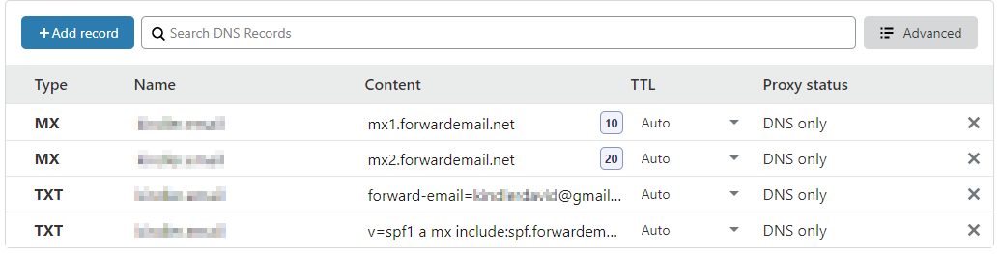

## How to catch email spammers

A little trick I use to catch email spammers is to use a catch-all email that is then forwarded to my primary email address.

Every time I am asked for an email address from some marketer or website that I know I will rarely visit I give them a unique email address. Ususally I just use their company name. For example: _somewebsiterarelyvisited@myemaildomain.com_.

This email is then forwarded to may primary email at Gmail. If that email address is ever used by someone else I know they have sold it. I can then choose to block that email address or the email sender.

### Here is the setup that I use:

Register a domain that is used strictly for email. For myself I registered using the top level domain (TLD) _.email_ from [namecheap.com](https://namecheap.com). There are many TLDs you can choose from. Some of these are not recognized or are occasionally filtered but that is becoming less frequent as these become more popular.

You will now need to setup a method to forward any email that is sent to this domain to be redirected to your primary email address.

If you are using [namecheap.com](https://namecheap.com) they have a service that will allow you to redirect email, provided you use their DNS service. Just follow their directions [here](https://www.namecheap.com/support/knowledgebase/article.aspx/308/2214/how-to-set-up-free-email-forwarding) on email forwarding for your domain name.

If you are using a different DNS service, like [Cloudlare](https://cloudflare.com), which is a great product that can be used for free, then you will need to make use of a email forwarding service. Your hosting site may have that service available to you. If not check out [forwardemail.net](https://forwardemail.net).

Forwardemail.net is a free email forwarding site that provides this service for free for any custom domain. In addition, you can send mail with your custom domain using Gmail.

Setup requires adding two DNS MX records and two DNS TXT records. Directions are very straightforward and can be found [here](https://forwardemail.net/#/?id=how-do-i-get-started-and-set-up-email-forwarding).

When done your setup should look something like this:

